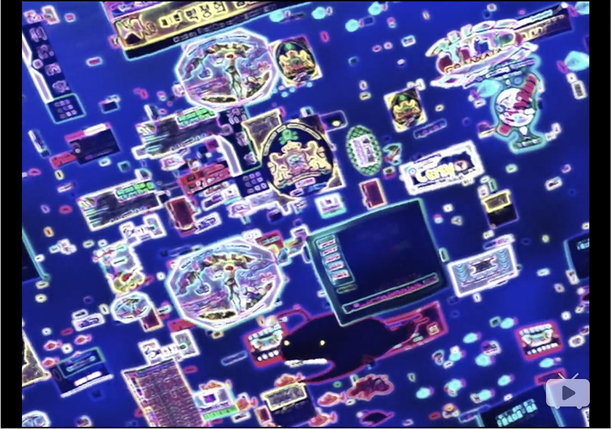
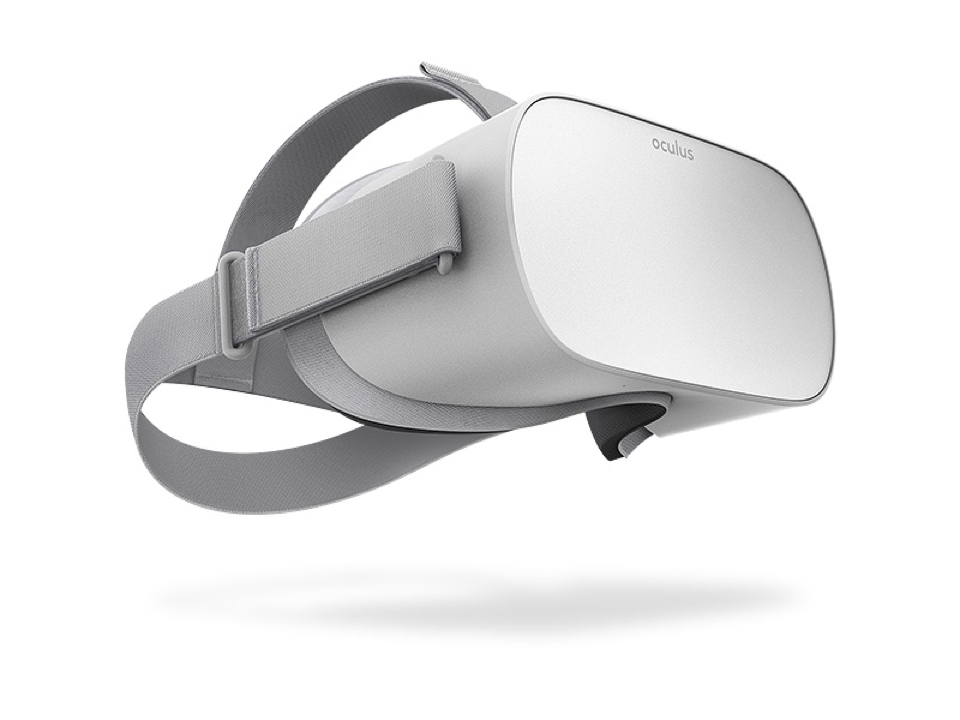
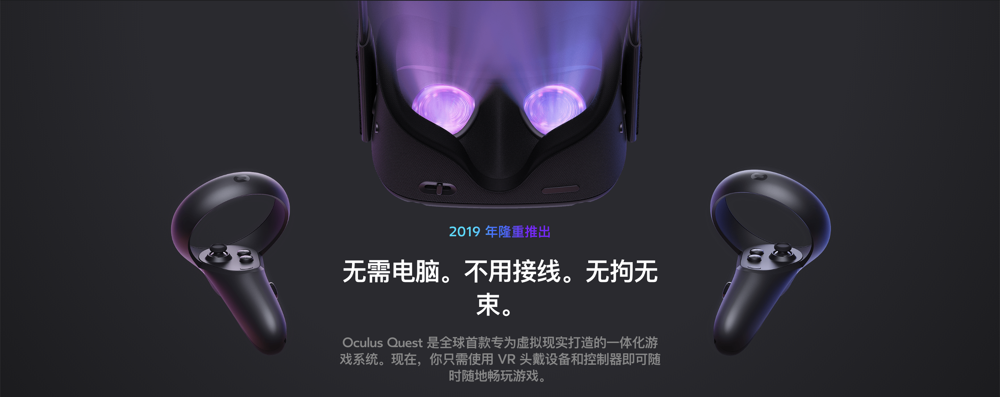

我对 VR 最早的认识，回想起来，是来源于一部1998年的动画「星际牛仔」，背景设定在2071年，电脑天才 Edward 浏览网络的方式，构成了我对 VR 最核心也最持久的印象。

也许在1998年的人看来，VR 要到2071年才能普及，但对于处于2019年的我来说，VR 在近两年就会逐渐融入我们的生活，改变我们的习惯，同时带来前所未有的巨大变革。

同时，我也清楚地知道，在大多数人眼中，VR 不再新鲜，或是早已过气的东西，人们的印象也停留在简陋的 Cardboard，或是在客厅吃灰的 HTC Vive / Oculus Rift / PS VR，反而他的孪生兄弟 AR，随着 Pokemon Go 的火热而走红，在各种营销活动中大放异彩。这些无疑都是客观现实，看似 VR 的处境并不妙，但是我仍会坚持我的结论，后边我会给出理由。

去年很偶然的情况下，我看到了一款准备发售的 VR 设备的消息，「Oculus GO」

这是一台 VR 一体机，完全独立运行，不要插入手机或者连接电脑，Oculus 也有相对不错的软件生态，各方面了解下来我确信，这也许是以较低成本体验优质 VR 的最优设备了，发售之后就第一时间买到手，这机器并没有让我失望，除了依赖路由器翻墙激活设备以外，整体的使用感受很棒，我给很多身边的人体验过，大多数人都赞不绝口，有人沉迷其中，也有人被我成功安利入坑；使用之后也让我想明白了一件事，我之前一直在长草的 VR 设备，尤其是 PS VR，一直把手按在下单按钮的边缘，但最终没有买到手的原因，是来源于我对 VR
最初的印象，或者是我对它的期待：它不是被困在客厅的游戏机附属设备，而是一个能够融入生活的，带来不同于以往体验的设备，或许就像现在的手机一样。

也正是入手这台机器，让我对 VR 的未来充满了信心，Oculus Store 中有着大量的令我感到意外的优质应用:
- 「Virtual Virtual Reality」的脑洞让我目瞪口呆 
- 「Oculus Rooms」让我感受到了 Facebook 对未来虚拟社交的布局，
- 「Within」让我意识到来自影视领域的专业人士具有的前瞻性以及对于极致体验的追求
- 「DMM」让我体验了日本 AV 行业的全新尝试

另外我在 Facebook 上加入了 Oculus Go Community，每天都能看到很多关于这台设备的讨论，我能从中感受到他们对于 VR 的热情，这些事情都让我对 VR 的未来充满信心。

去年我还看了一个对我触动很深的 TED [The birth of virtual reality as an art form](https://www.ted.com/talks/chris_milk_the_birth_of_virtual_reality_as_an_art_form)，我反复看了几十遍，有一阵几乎是每天回家打开看一遍，让我确认了，这就是我以后要做的事情。

回过头来说下目前 VR 存在的问题，我目前的观点是：只存在一个最大的问题，就是缺少一台把体验做到极致的设备，缺少一台像 iPhone 一样，靠一己之力将世界带入移动互联网的传奇设备。目前存在于市面上的设备，就像是当年搭载了 window mobile 系统的多普达，使用过的人应该深有体会，能用但不好用，有使用场景但很难普及，这些设备虽然存在各种各样的问题，但不能否认的是，他们是先驱者，为日后的 iPhone 和 Andriod
的诞生提供经验教训，我也相信这样设备也许正在研发之中，比如要在今年春天发售的「Oculus Quest」

它是「Oculus Go」的继任者，6DoF 一体机，配置景深摄像头，扫描现实环境后虚拟化，配备动作追踪设备，这是我能想到的最佳设备了，在这台机器公布之前我就有这样的设想，而当你知道你设想的机器就要发售的时候当然是无比激动的。

也许有人会说，你说了这么多不过是在自 high，关我什么事，我并没有使用 VR 的需求，尤其是在日常生活中，这点其实很有趣，就像在 2007 年初使用诺基亚 s60 机器的你，同样也没有使用未来几个月才要会出现的 iPhone 的理由，大多数用户并不能感知自己的需求，而真正伟大的事物，并不是着眼于解决当下的问题，而是负责将人们引领至未来。
